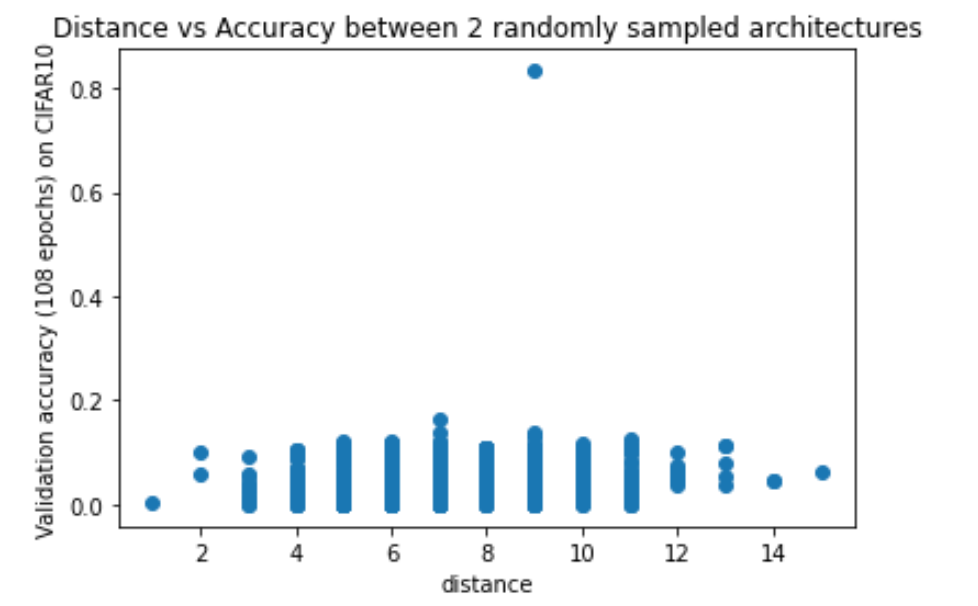

## NAS Search using NASBench-101 

NASBench-101 is a dataset of CNN architectures that are evaluated on CIFAR-10 dataset for different number of epochs.

The goal of this project is

1. To compare performance of different search algorithms for this dataset.
2. o gain some insights about this dataset.
3. To compare performance of sampled architectures on some other dataset compared to its performance on CIFAR-10.

In the following figure we compare performance different search algorithms for 10 runs. The metric is how fast the search algorithm finds the architecture with highest accuracy. 
The following figure shows accuracy over time. 

The following figure shows mean accuracy and variance over time. 

The following figure shows accuracy over number of nodes explored. 

The following figure shows mean accuracy and variance over numberof nodes explored. 

We see that the performance of the tree search is not very satisfactory. One of the reasons is that it is not exploring as many number of cells as random search or evolution search. But even when number of nodes is same, for high enough number of, the performance is not better.

Tree Search performs well when we assume that the neighbouring points have similar rewards. So we test this assumption in the following code.

Distance between two cells is measured as follows:

We generate edge triplets (Node1, edge, Node2) for each cell, as cell is a DAG.
Distance is how many tuples are in cell1 that are not in cell2, plus the size difference between cell1 and cell2.
The distance is commutative.

As seen in the figure below, there is not a high correlation between distance and performance of CNN of composed of cells. That means, similar cells, don't necessarily yield similar accuracies. (So, tree search is not a good search algorithm for this dataset).

As seen in figure below, we notice that the performance of sampled architectures are highly correlated. The correlation is higher with large number of epochs, as network reaches more stability.

This is a good news! If good architectures perform well on multiple datasets, it could give us a good starting point when we are selecting architecture for our own CNN project.

We need to test the correlation between other datasets though before we can make any generalizations.

